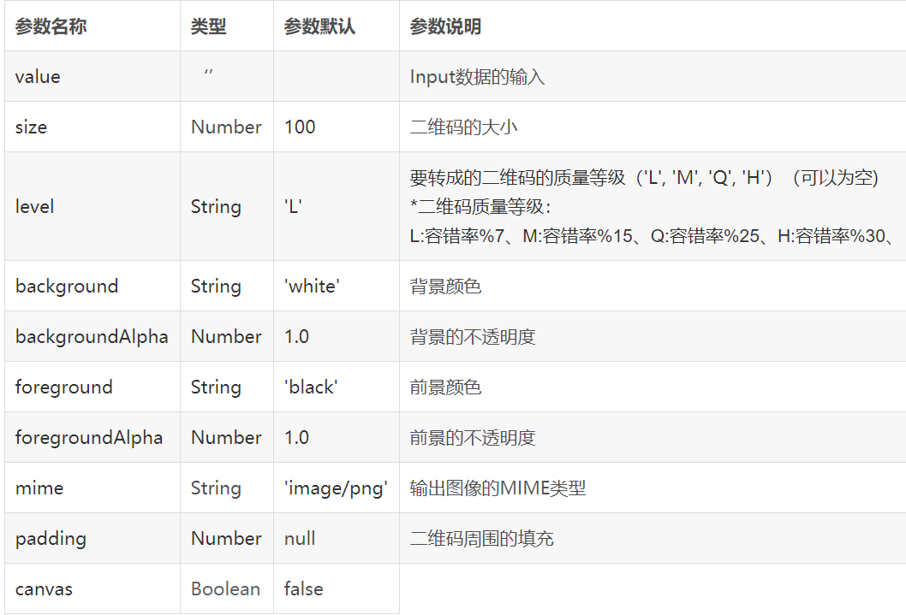

# BaseTemplate

This project was generated with [Angular CLI](https://github.com/angular/angular-cli) version 8.3.20.

## Development server

Run `ng serve` for a dev server. Navigate to `http://localhost:4200/`. The app will automatically reload if you change any of the source files.

## Code scaffolding

Run `ng generate component component-name` to generate a new component. You can also use `ng generate directive|pipe|service|class|guard|interface|enum|module`.

## Build

Run `ng build` to build the project. The build artifacts will be stored in the `dist/` directory. Use the `--prod` flag for a production build.

## Running unit tests

Run `ng test` to execute the unit tests via [Karma](https://karma-runner.github.io).

## Running end-to-end tests

Run `ng e2e` to execute the end-to-end tests via [Protractor](http://www.protractortest.org/).

## Further help

To get more help on the Angular CLI use `ng help` or go check out the [Angular CLI README](https://github.com/angular/angular-cli/blob/master/README.md).

## 第三方组件

1. [angular2-qrcode]( https://github.com/SuperiorJT/angular2-qrcode )  生成二维码 (不支持中文)

   ```git
   npm install angular2-qrcode --save 
   ```

   

   

2. **[JsBarcode](https://github.com/lindell/JsBarcode)**  生成条形码

   -  把JsBarcode.all.min.js放在assets/libs文件夹下 

   - 在angular.json文件里引入 JsBarcode.all.min.js

   - 使用的组件中加入declare var JsBarcode: any;

     注意：要在组件视图初始化加载完才可以调用生成条形码方法，因此生成条形码函数要写在生命周期 `ngAfterViewInit`中

3.  [eventemitter3]( https://github.com/primus/eventemitter3 )  事件侦听器 

   ```git
    npm install  eventemitter3  --save
   ```

   ```js
   import {EventEmitter} from 'eventemitter3';
   const myEmitter = new EventEmitter();
   //监听事件event
   myEmitter.on('event', function firstListener(arg1, arg2) {
     console.log('Helloooo! first listener');
   });
   //发送事件event
   myEmitter.emit('event', 1, 2, 3, 4, 5);
   ```

   

4. 